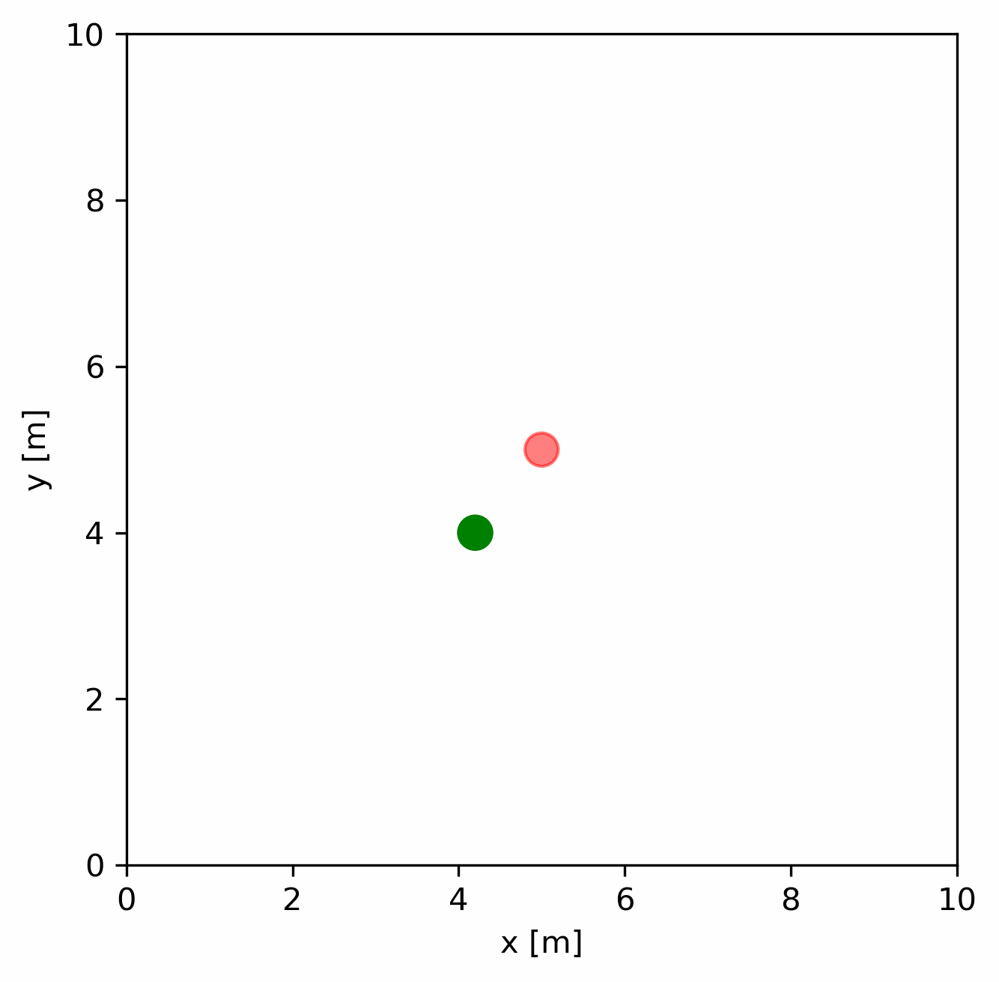
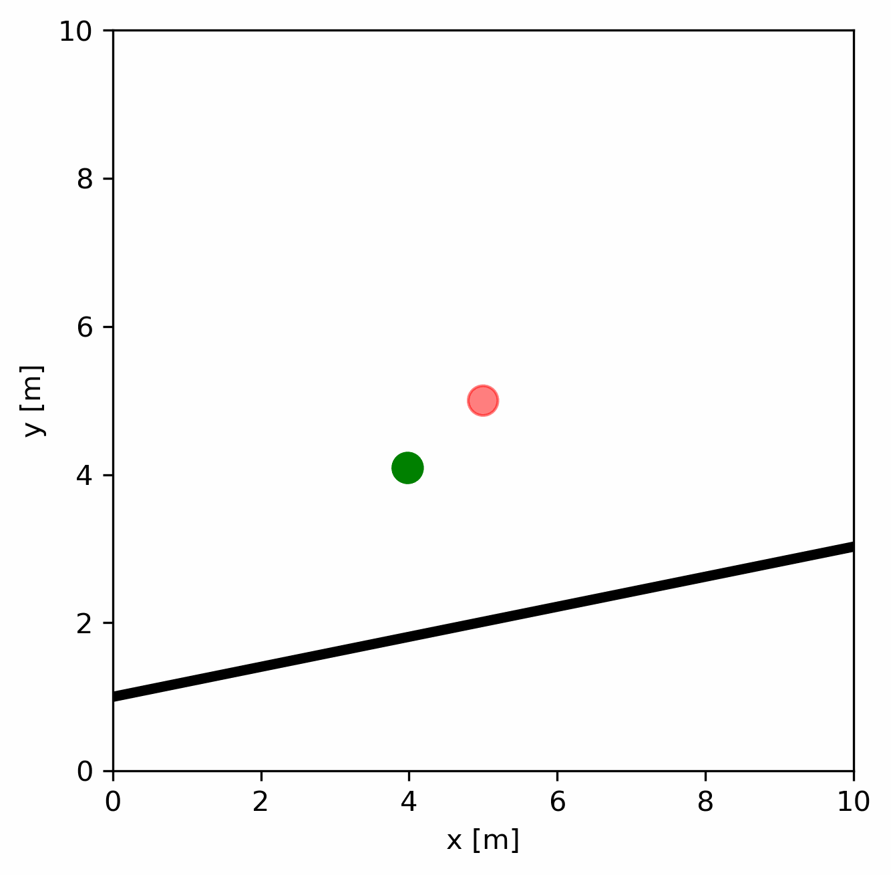
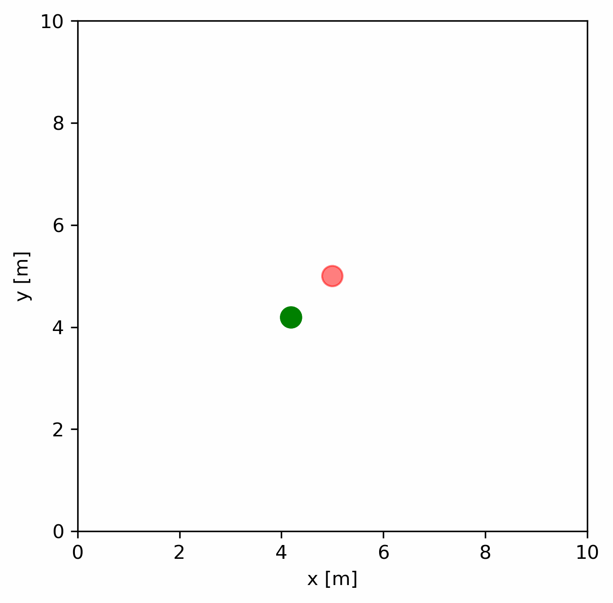
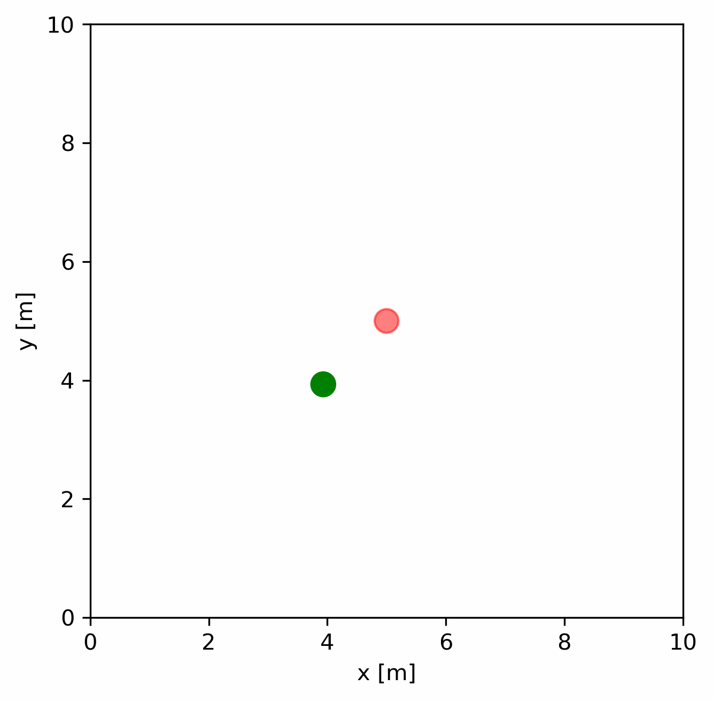
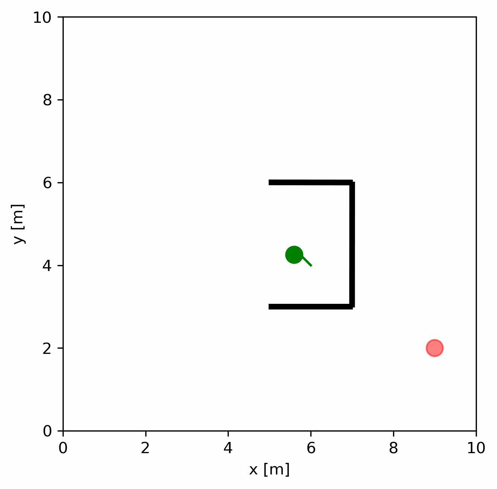

# Homework2

>12111224  
>贾禹帆

## Question 1

1. In dynamic environment or explore situtation, behavior-based is more acceptable. If we already know the whole environment, we can use optimization-based methods to get better performance and better planning if we have multiple tasks.
1. *Robustness*: Behavior-based robots can handle unexpected situations better as they react to real-time sensory inputs.
  *Simplicity*: Each behavior module is simple and easy to design and implement.  
  *Modularity*: Systems are made up of independent behavior modules that can be added or modified without affecting the entire system.  
  *Adaptability*: Capable of adapting to a variety of environments and tasks due to their decentralized control system.  
  *Real-Time Performance*: Efficient in dynamic environments due to quick response to sensory feedback.  
1. It hard for one single approach to handle all the tasks and environments for a long term, there may be many unexpected situations. We can combining behavior-based models for real-time interaction and adaptation, along with more traditional AI for complex problem solving and planning.

## Question 2

1.

$$
Uniform: \overrightarrow v=\overrightarrow v_0\\
Perpendicular:\overrightarrow v=\eta  \overrightarrow h \frac{v_p}{h^3}\\
Attractive:\overrightarrow v = \xi  (\overrightarrow r - \overrightarrow r_0)|\overrightarrow r - \overrightarrow r_0|*v_0\\
Repulsive:\overrightarrow v = \eta  (\overrightarrow r - \overrightarrow r_0)\frac{v_0} {|\overrightarrow r - \overrightarrow r_0|^3}\\
Tangential:\overrightarrow v=\overrightarrow w_0\times(\overrightarrow r - \overrightarrow r_0)\\
$$

1. Results:

## Question 3

