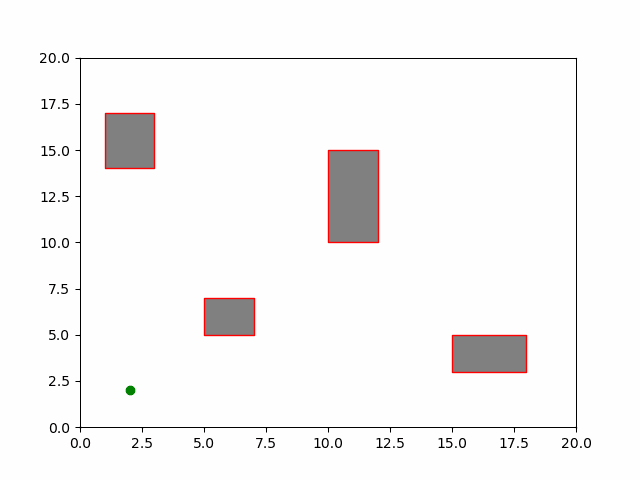
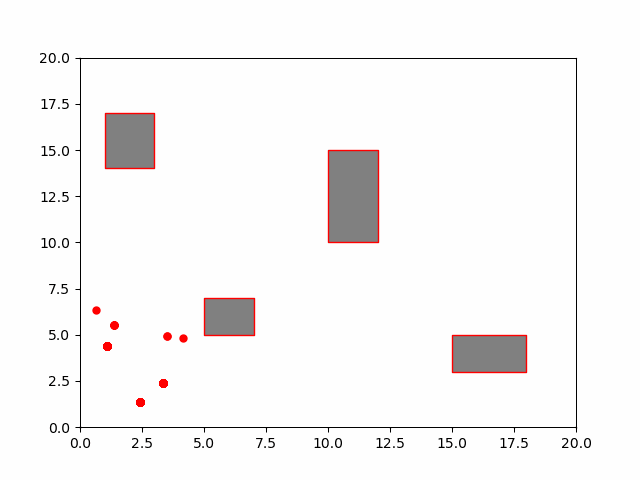

# Assignment 7

[toc]

## Task 1

### 1. Prediction

In the prediction step, the Kalman Filter estimates the state of the process at the next time step. It uses the previous state and the control input. The equations are as follows:

- **Predicted State Estimate**
  $$
  \hat{x}_{k|k-1} = F_k \hat{x}_{k-1|k-1} + B_k u_k
  $$
  Where:
  - $\hat{x}_{k|k-1}$ is the predicted state estimate.
  - $F_k$ is the state transition model.
  - $\hat{x}_{k-1|k-1}$ is the previous state estimate.
  - $B_k$ is the control input model.
  - $u_k$ is the control input.

- **Predicted Covariance Estimate**
  $$
  P_{k|k-1} = F_k P_{k-1|k-1} F_k^T + Q_k
  $$
  Where:
  - $P_{k|k-1}$ is the predicted covariance estimate.
  - $P_{k-1|k-1}$ is the previous covariance estimate.
  - $Q_k$ is the process noise covariance.

### 2. Update

During the update step, the filter incorporates the new measurement into the predicted state estimate to refine its estimates.

- **Kalman Gain**
  $$
  K_k = P_{k|k-1} H_k^T (H_k P_{k|k-1} H_k^T + R_k)^{-1}
  $$
  Where:
  - $K_k$ is the Kalman Gain.
  - $H_k$ is the measurement function.
  - $R_k$ is the measurement noise covariance.

- **Updated State Estimate**
  $$
  \hat{x}_{k|k} = \hat{x}_{k|k-1} + K_k (z_k - H_k \hat{x}_{k|k-1})
  $$
  Where:
  - $\hat{x}_{k|k}$ is the updated state estimate.
  - $z_k$ is the measurement at time $k$.

- **Updated Covariance Estimate**
  $$
  P_{k|k} = (I - K_k H_k) P_{k|k-1}
  $$
  Where:
  - $P_{k|k}$ is the updated covariance estimate.
  - $I$ is the identity matrix.

## Task 2

## Task 3

